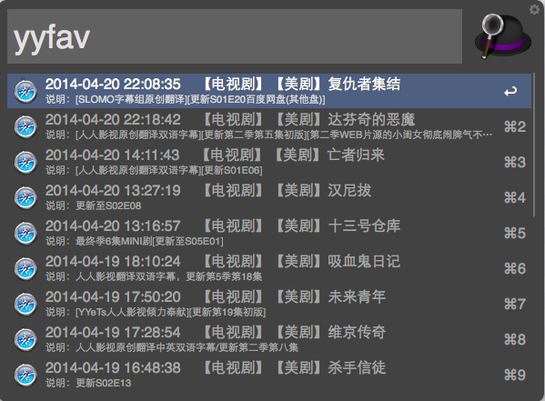

alfred-workflows
================

All my aflred workflows

#[2014/4/19] jekyll-blogger

A workflow to create post/pages, start local debugging server, push changes and local building.   
Before you use it, config following parameters in Readme tab after you installed this workflow.  

```
# Set your Jekyll path here:  
# replace the path string with your own  
JEKYLL_PATH:/Users/Drinkey/Code/Github/drinkey.gitcafe.com  
LOCAL_BRANCH:orignal  
REMOTE_REPOS:gitcafe-pages  
# this can be subl or vim or any editors can be launched from Shell  
EDITOR:subl  
```

Snapshot   


#[2014/4/20] YYeTs favorite

Show your YYeTs favorite list of fist page, if you'd like to check out details, just press Enter:)
 
**IMPORTANT!!!!!!!**  
!!!!!!!!!!!!!!!!!!!!!!!!!!!!!!!!!!!!!!!!!!!!!!!!!!!!!!!!!!!!!  
Before you use this workflow, please set your username and password of your yyets account in Trigger script.  

```
data['account'] = "YOUR_USERNAME"

data['password'] = "YOUR_PASSWORD"

```
set them with your own credential.  
!!!!!!!!!!!!!!!!!!!!!!!!!!!!!!!!!!!!!!!!!!!!!!!!!!!!!!!!!!!!!

Snapshot  


#[2014/4/21] WooYun papers

List Wooyun knowledge base papers.

Snapshot-1


Snapshot-2


#[2014/4/22] Shuttle Launcher

Launch connection with Shuttle config.  


If you're using Shuttle to manage your connections, this work would help you.

Shuttle is just a connection organizer, with a JSON format configuration file. This workflow will read the JSON file first and list it in Alfred drop list. Choose the item will open a terminal session with login command.

Snapshot-1


Snapshot-2


